# Upwind Home Assignment

This repository contains my implementation of the Upwind home assignment.

The project is divided into three assignments.  
Each assignment includes the required implementation, the official bonus where relevant, and evidence screenshots.

---

## Quick Start

### Setup

```bash
make setup
```

### Run Tests

```bash
make test
```

---

## Assignment Coverage

| Assignment | Status | Scope |
|---|---|---|
| Assignment 1 | Completed | Email Phishing Detector |
| Assignment 2 | Completed | Malware Analysis Sandbox |
| Assignment 3 | Completed | SQL Injection Demo + Mitigation |

---

<details>
<summary><strong>Assignment 1 – Email Phishing Detector</strong></summary>

## Original Requirement

Implement a script that scans email content for common phishing indicators and alerts the user to potential phishing attempts.

The detector should:

- Accept a text file containing email content
- Detect suspicious links
- Detect URLs with uncommon domains
- Detect IP addresses in URLs
- Detect spoofed sender addresses
- Detect urgent language
- Print a clear summary with the detected indicators

## What I Built

I built a Python CLI phishing detector.

Main file:

```text
src/phishing_detector.py
```

Sample emails:

```text
samples/
```

The detector scans email text and returns a summary showing whether the email is likely a phishing attempt.

## How to Run

```bash
make run-cli
```

Or directly:

```bash
python3 src/phishing_detector.py samples/phishing_combined.txt
```

## Expected Result

```text
Likely phishing attempt: YES
Detected indicators: 7
```

## Bonus – Web UI

I added a local Flask UI for uploading an email text file and viewing the scan results in the browser.

Run:

```bash
make run-ui
```

Open:

```text
http://127.0.0.1:5000
```

## Bonus – Gmail Add-on Prototype

I added a Gmail Add-on prototype using Google Apps Script.

Folder:

```text
gmail-addon/
```

This prototype is designed to scan the currently opened Gmail message and show phishing detection results inside Gmail.

## Evidence

### CLI Detection

This screenshot shows the CLI detecting multiple phishing indicators from a sample email.

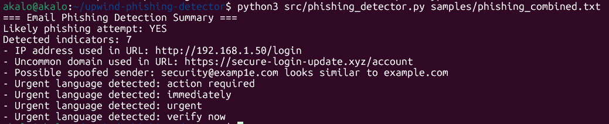

### Web UI Detection

This screenshot shows the web UI displaying phishing detection results after uploading an email file.

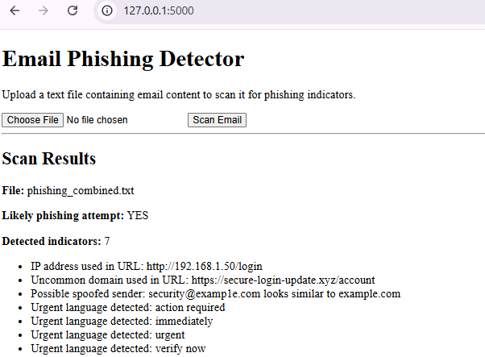

</details>

---

<details>
<summary><strong>Assignment 2 – Malware Analysis Sandbox</strong></summary>

## Original Requirement

Develop a sandbox environment that executes and monitors a sample piece of malware and captures its behavior.

The sandbox should monitor:

- File system changes
- Network connections
- Process activity

It should also generate a report summarizing the behavior.

## Safety Note

I did not run real malware.

Instead, I created a safe simulated sample that demonstrates suspicious behavior in a controlled and isolated environment.

## What I Built

I built a Docker-based sandbox.

Main files:

```text
assignment2_sandbox/Dockerfile
assignment2_sandbox/monitor.py
assignment2_sandbox/samples/safe_sample.py
```

The safe sample simulates:

- Creating a file
- Modifying a file
- Deleting a file
- Spawning a process
- Opening local network activity

The monitor runs the sample, collects behavior, and generates:

```text
assignment2_sandbox/logs/sandbox_log.json
assignment2_sandbox/reports/sandbox_report.txt
```

## How to Run

Build the sandbox image:

```bash
make assignment2-build
```

Run the sandbox analysis:

```bash
make assignment2-run
```

Run the UI:

```bash
make assignment2-ui
```

Open:

```text
http://127.0.0.1:5001
```

## Expected Result

The sandbox report shows:

- Created files
- Modified files
- Deleted files
- Spawned processes
- Local network activity

## Bonus – Sandbox UI

I added a Flask UI that can start the sandbox, stop it if needed, and display the generated report and raw JSON log.

## Evidence

### Docker Build

This screenshot shows the Docker sandbox image building successfully.

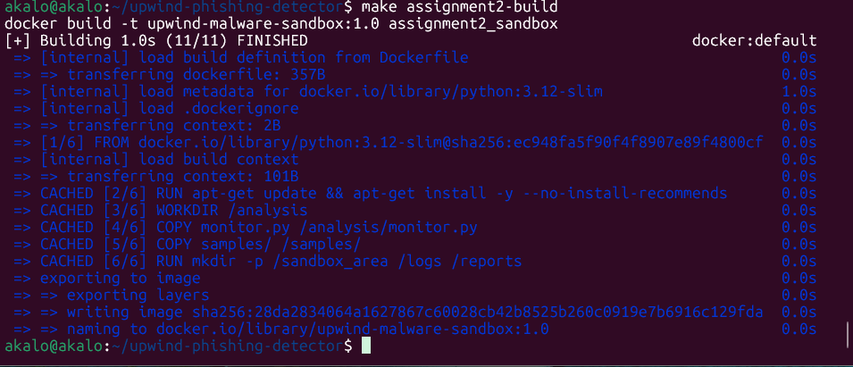

### Terminal Report

This screenshot shows the generated sandbox report in the terminal.

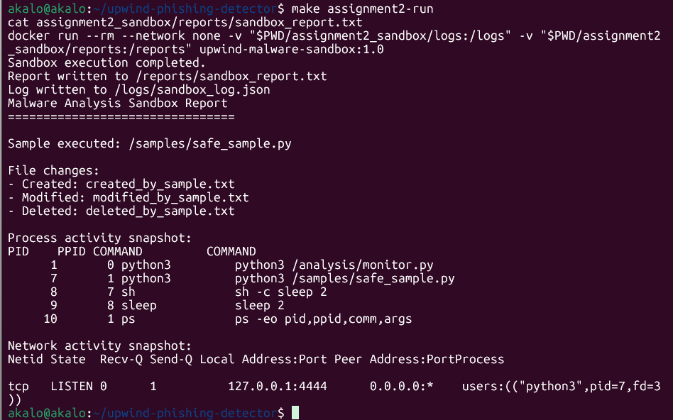

### Sandbox UI Report

This screenshot shows the UI displaying the generated behavior report.

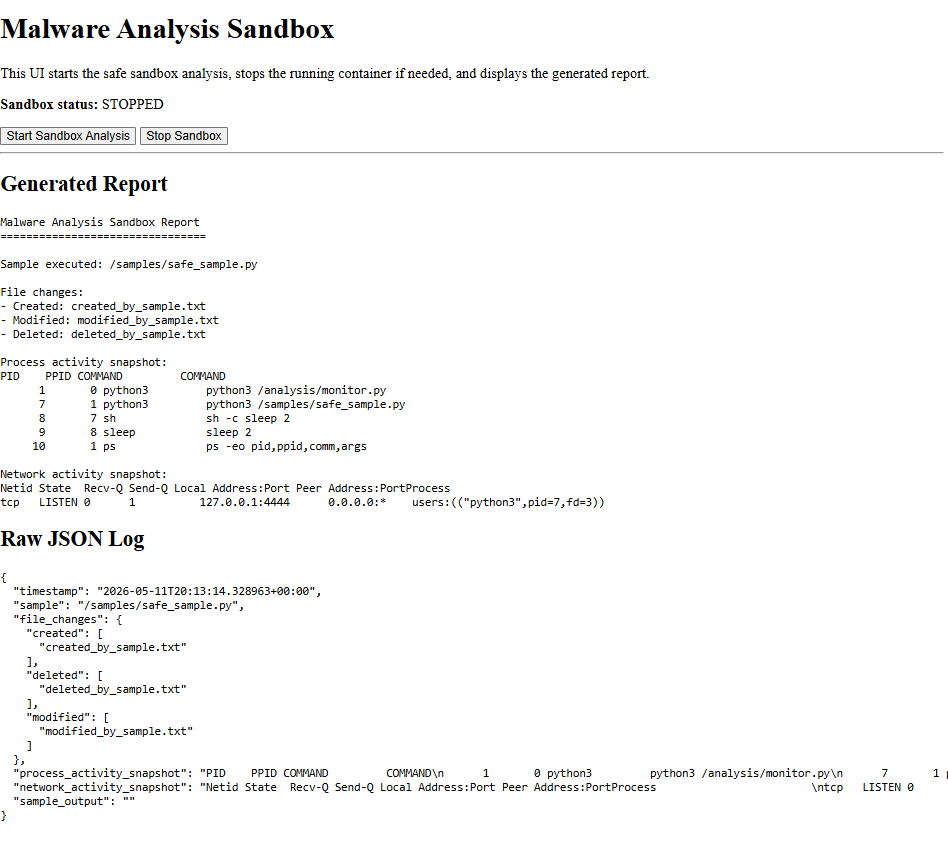

### UI Terminal Requests

This screenshot shows Flask receiving browser requests such as `GET` and `POST`.

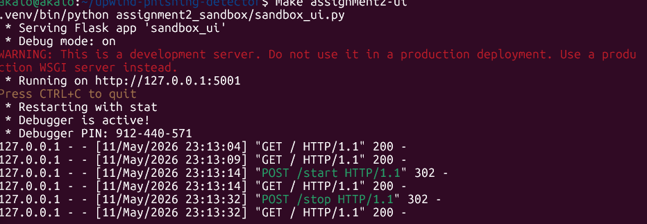

### Raw JSON Log

This screenshot shows the raw JSON log generated by the sandbox monitor.

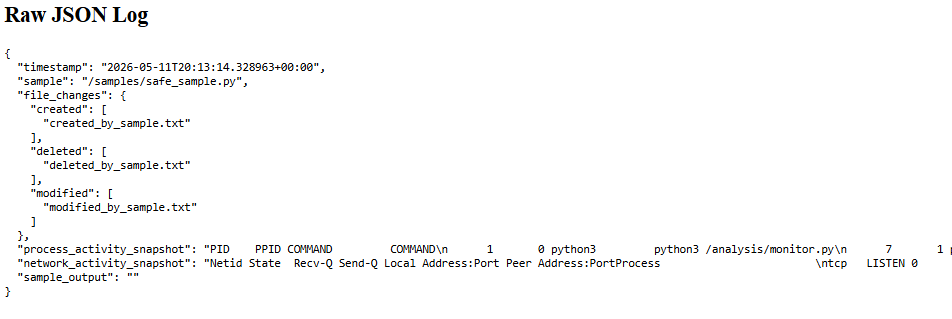

</details>

---

<details>
<summary><strong>Assignment 3 – SQL Injection Demo</strong></summary>

## Original Requirement

Develop a simple web application and demonstrate a SQL Injection attack, then implement measures to prevent it.

The application should include:

- A basic login form
- A database with user credentials
- A vulnerable login flow
- A secure login flow
- A SQL Injection bypass demo
- A mitigation using parameterized queries

## What I Built

I built a local Flask web application with SQLite.

Main files:

```text
assignment3_sqli/app.py
assignment3_sqli/database.py
assignment3_sqli/templates/index.html
```

The application has two login flows:

- Vulnerable Login
- Secure Login

Both are shown in the same UI to make the difference clear.

## How to Run

Initialize the database:

```bash
make assignment3-init-db
```

Run the UI:

```bash
make assignment3-ui
```

Open:

```text
http://127.0.0.1:5002
```

## Test User

```text
Username: admin
Password: SecurePass123
```

## SQL Injection Payload

```text
' OR '1'='1
```

## Expected Result

### Vulnerable Login

The SQL Injection bypass succeeds.

```text
Status: Login successful
```

### Secure Login

The same SQL Injection attempt fails.

```text
Status: Login failed
```

## Mitigation

The secure login uses parameterized queries.

This means user input is treated as data and cannot change the SQL query structure.

## Bonus – UI

The UI demonstrates both the vulnerable and secure login flows and shows the attack results clearly.

## Evidence

### Valid Login

This screenshot shows that normal login works with valid credentials.

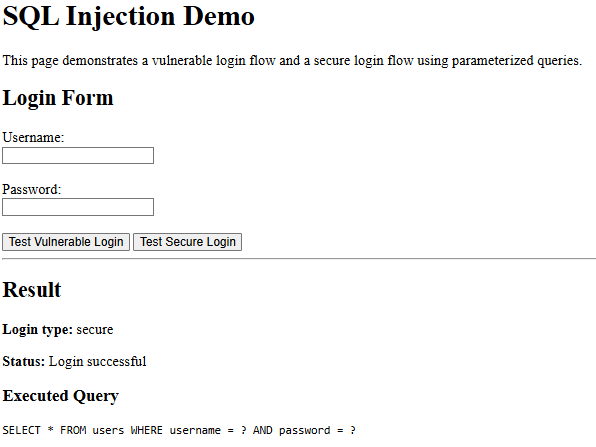

### Vulnerable Login Bypass

This screenshot shows the vulnerable login being bypassed using SQL Injection.

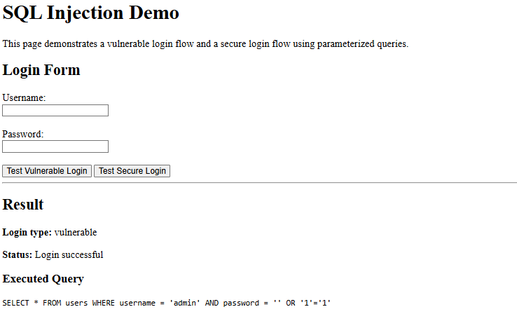

### Secure Login Blocked

This screenshot shows the same SQL Injection attempt failing against the secure login.

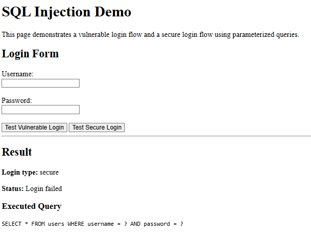

</details>

---

<details>
<summary><strong>Professional Enhancements</strong></summary>

## Makefile

I added a Makefile to make the project easier to run and review.

Common commands:

```bash
make setup
make test
make run-cli
make run-ui
make assignment2-build
make assignment2-run
make assignment2-ui
make assignment3-init-db
make assignment3-ui
```

## Docker

Docker is used where it adds value:

- Assignment 1: Run the phishing detector UI in a container
- Assignment 2: Provide sandbox isolation using a container

## GitHub Actions CI

GitHub Actions runs automated tests on push and pull requests.

Evidence:

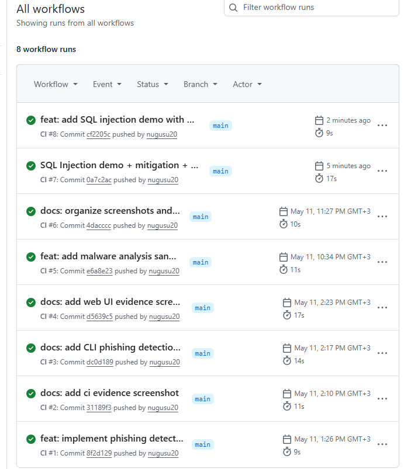

## Automated Tests

The project includes pytest tests for the phishing detector logic.

Run:

```bash
make test
```

</details>

---

<details>
<summary><strong>Security & Permissions</strong></summary>

## Local and Safe Execution

All demonstrations are local and controlled.

- No real malware was used
- The sandbox uses a safe simulated sample
- SQL Injection is demonstrated only against the local demo application
- No external systems are attacked

## File Permissions

The project uses standard Linux permissions:

| Type | Permission | Meaning |
|---|---|---|
| Directories | `755` | Readable and accessible project folders |
| Files | `644` | Readable code/docs without unnecessary execute permission |

No world-writable permissions such as `777` are used.

## Secrets

Sensitive and local files are excluded from Git:

```text
.venv/
.env
*.db
__pycache__/
.pytest_cache/
```

</details>

---

## Project Structure

```text
.
├── assignment2_sandbox/
├── assignment3_sqli/
├── docs/
│   └── screenshots/
├── gmail-addon/
├── samples/
├── src/
├── tests/
├── Dockerfile
├── Makefile
├── README.md
└── requirements.txt
```
